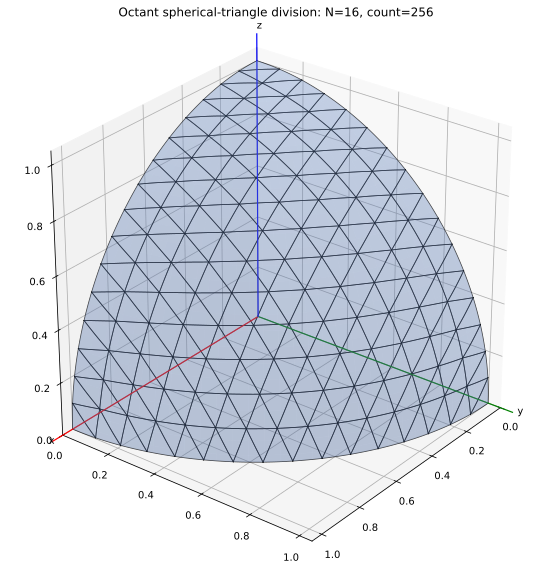
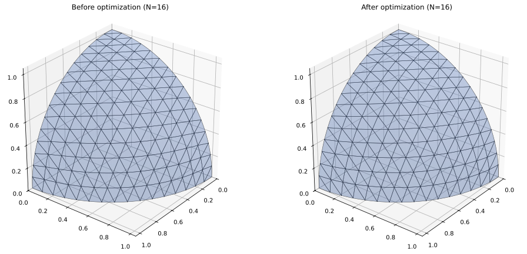
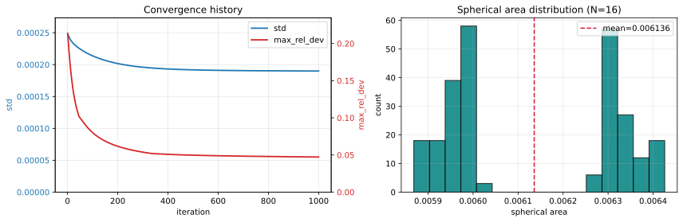
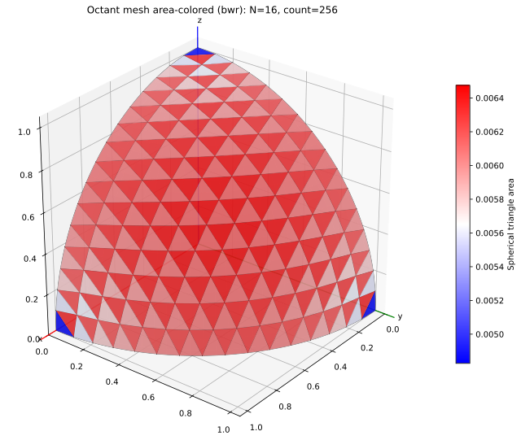
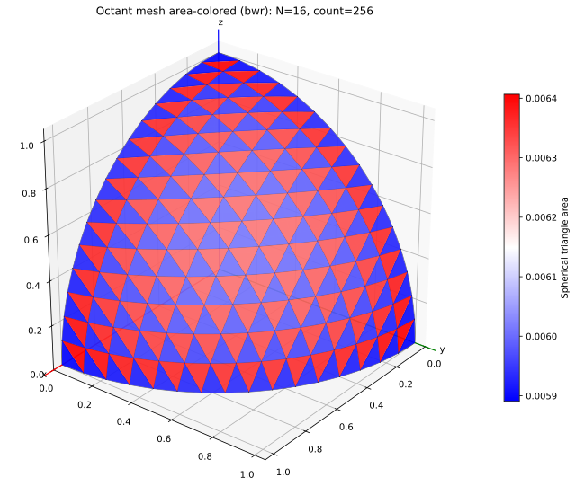

# Sphere Triangle Division（日本語版）

球面八分体（`x, y, z >= 0`）を `N²` 個の球面三角形に分割するノートブックプロジェクト。

面積最適化後の結果（決定論的 tension iterator）:

収束履歴と最終面積分布:

球面三角形の面積カラー表示（`bwr`, 青=小面積, 赤=大面積）:

最適化前:

最適化後:

## ファイル一覧

- `sphere_octant_division.ipynb`: メッシュ構築・可視化・検証のメインノートブック
- `sphere_octant_division_with_area_optimizer.ipynb`: 球面三角形面積の分散を下げる決定論的反復最適化ノートブック
- `division_result_viewer.ipynb`: 保存済み分割 JSON を読み込み、面積ベース色付け（`bwr`）で球面三角形を可視化（最適化前後の表示を含む）
- `sphere_geometry_util.py`: 単位球面上の測地線弧サンプリング用ユーティリティ
- `sphere_index_util.py`: インデックス共通ユーティリティ（`iter_valid_ij`, `k_from_ij`, 検証/点数計算補助）
- `sphere_division_algorithms.py`: 両ノートブックで利用するメッシュ・面積・制約・最適化アルゴリズム
- `sphere_division_visualization.py`: 可視化ユーティリティ（八分体メッシュ、履歴/分布、最適化前後比較）
- `results/division_result_*.json`: 面積最適化が十分に収束した点座標JSONファイル
- `figures/octant_n_squared_division.svg`: ノートブックのサンプルセル（`N=16`）で生成される図
- `figures/octant_n_squared_division_with_area_optimizer.svg`: 球面上の最適化前後メッシュ比較
- `figures/octant_n_squared_division_with_area_optimizer_history.svg`: 収束履歴（`std`, `max_rel_dev`）と最適化後面積ヒストグラム
- `figures/octant_mesh_before_area_optimizer_16.svg`: 最適化前の面積カラー表示（`bwr`）メッシュ
- `figures/octant_mesh_after_area_optimizer_16.svg`: `results/division_result_16.json` 読み込み後の面積カラー表示（`bwr`）メッシュ

## 座標データ形式

- 点座標は NumPy 配列 `shape=(N+1, N+1, 3)` で表現します。
- xyz へのアクセスは `positions[i, j]`（または `points[i, j]`）を使用します。
- `i + j > N` のインデックスは無効で、`NaN` を格納しアルゴリズムでは使用しません。
- 三角形頂点キーは `(i, j)` タプルで、必要時に `k = N - i - j` を導出します。

## 実行方法

1. `sphere_octant_division.ipynb` を開く
2. すべてのセルを実行
3. サンプル可視化セルで以下を出力:
   - `figures/octant_n_squared_division.svg`
4. `sphere_octant_division_with_area_optimizer.ipynb` を開く
5. すべてのセルを実行して以下を生成:
   - `figures/octant_n_squared_division_with_area_optimizer.svg`
   - `figures/octant_n_squared_division_with_area_optimizer_history.svg`
6. `division_result_viewer.ipynb` を開く
7. すべてのセルを実行して以下を生成:
   - `figures/octant_mesh_before_area_optimizer_16.svg`
   - `figures/octant_mesh_after_area_optimizer_16.svg`

## 面積最適化メモ

- 初期条件: `sphere_octant_division.ipynb` で構築した八分体メッシュ
- 目的: 球面三角形面積を可能な限り均一化すること
- 更新則（決定論的）: 各三角形が全体平均からの符号付き面積誤差に基づいて頂点移動量を提案し、頂点ごとに隣接三角形の提案を平均して更新
- 制約: 各更新後に頂点を単位球面、八分体領域（`x,y,z >= 0`）、境界測地線弧（`x=0`, `y=0`, `z=0`）へ再投影
- 図の見方:
  - `...with_area_optimizer.svg`: 左が最適化前、右が最適化後
  - `...with_area_optimizer_history.svg`: 左が収束（`std`, `max_rel_dev`）、右が最終球面面積分布